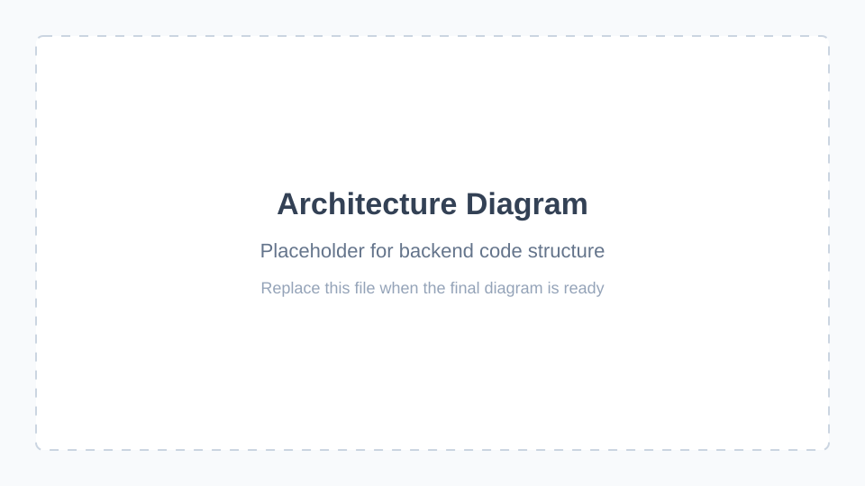

# Performer Booking API

This is the backend service for the Performer Booking App, a platform that connects performers with venue owners to simplify event booking and management. The API handles user authentication, event data, application workflows, and role-based access control.

## Project Overview
Performer Booking API is the backend service for Book A Gig, a full-stack web application that connects performers with venue owners to simplify event discovery, booking, and application management.

The API provides authentication, role-based authorization, event management, performer applications, and venue management through a RESTful Flask API.

This project was built to strengthen my backend engineering skills using Python while demonstrating API design, authentication, database integration, and role-based application workflows.

## Architecture Diagram
The diagram below will outline the backend code organization and show how the main Flask API layers fit together, including request handling, authentication, data access, models, and supporting helpers.



## Tech Stack
| Category       | Technology |
| -------------- | ---------- |
| Language       | Python     |
| Framework      | Flask      |
| Database       | PostgreSQL |
| Authentication | JWT        |
| API Style      | REST       |
| Testing        | Postman    |

## Why This Tech Stack
| Technology | Why I Chose It                                       |
| ---------- | ---------------------------------------------------- |
| Python     | Clean syntax and rapid backend development.          |
| Flask      | Lightweight framework focused on REST APIs.          |
| PostgreSQL | Relational database for structured application data. |
| JWT        | Stateless authentication for secure API access.      |
| Postman    | Simplifies API testing during development.           |

## Engineering Decisions
**RESTful API Design**  
Endpoints are organized around application resources such as Users, Events, Venues, and Applications to create a predictable API structure.

**Role-Based Authorization**  
Hosts and performers have different permissions, allowing business rules to be enforced at the API level.

**JWT Authentication**  
Authentication uses JSON Web Tokens to protect API endpoints without maintaining server-side sessions.

**Layered Project Organization**  
The application separates controllers, models, authentication utilities, and data access responsibilities to improve maintainability.

**PostgreSQL**  
A relational database was selected to model the relationships between users, events, venues, and performer applications.

## Features
**Authentication**
- User registration
- Login
- JWT authentication

**Event Management**
- Create events
- Update events
- View events

**Performer Applications**
- Apply for events
- Review applications
- Approve or deny performers

**Venue Management**
- Manage venues
- Associate venues with events

**User Management**
- Host accounts
- Performer accounts
- Role-based permissions


## Project Structure
```
booking-app-api/

├── DAL/               # Data Access Layer files
├── Data/              # Local JSON data files
├── Helpers/           # Helpers
├── Models/            # Data models
├── auth_utils/        # Authentication utilities
├── Authentication.py  # Misc utilities (e.g., validators)
├── Controller.py      # Request handler
└── Main.py            # Main app entry point
```

## API Documentation
For detailed endpoint documentation, see [API Documentation](docs/api_documentation.md).

## Getting Started
To set up the project locally, see [Local Environment Setup](docs/local_environment_setup.md).

## Roadmap
No upcoming features are planned at this time.
